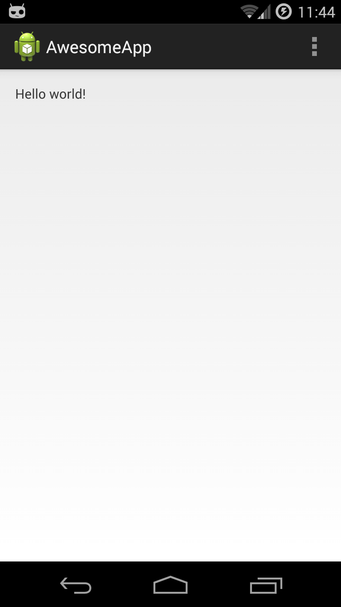
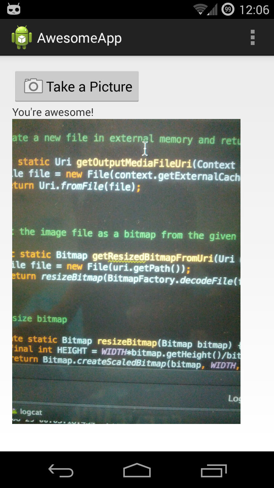
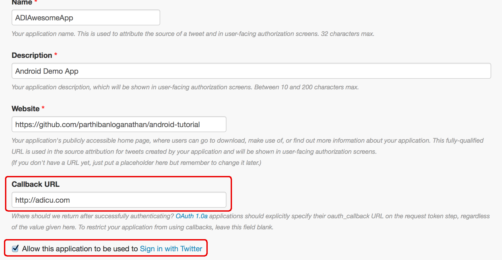
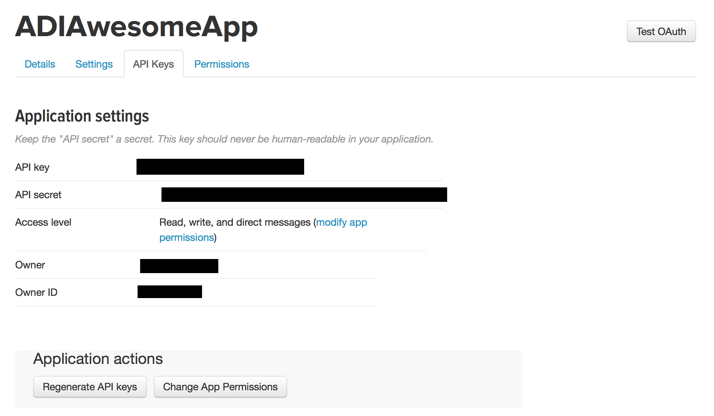
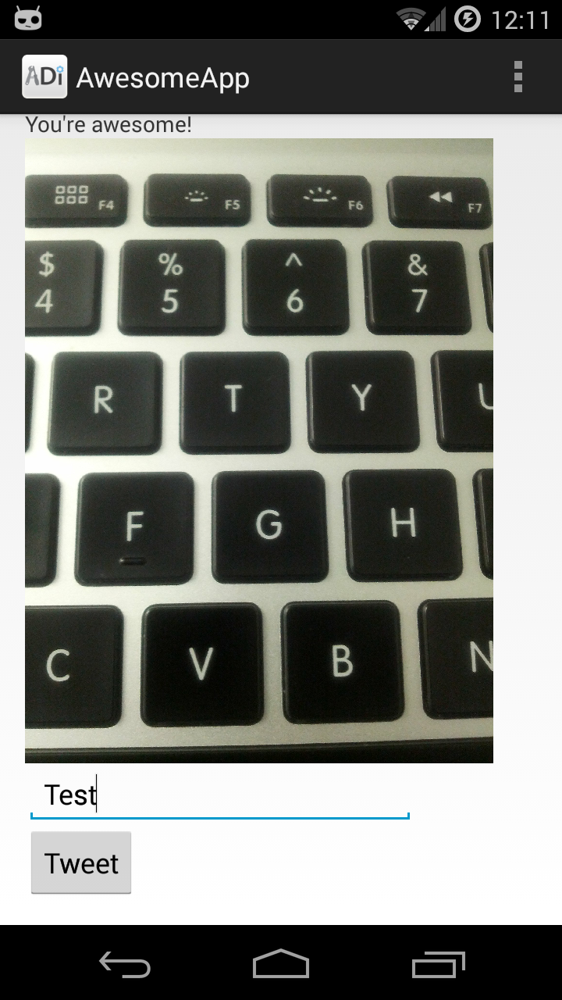
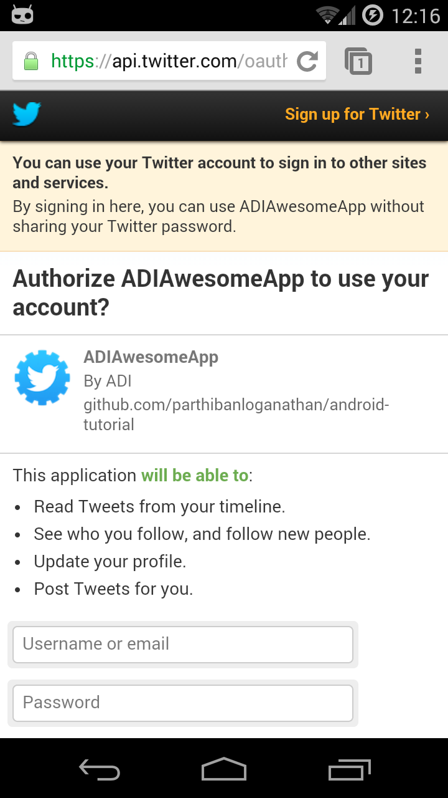
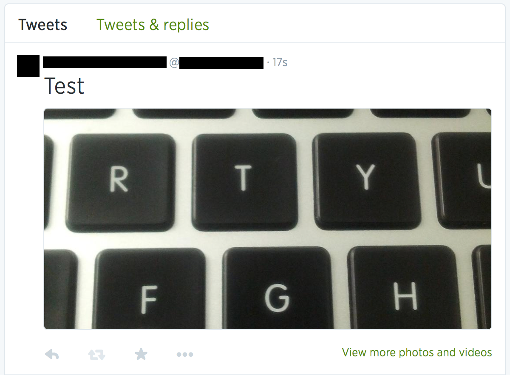

Do Android Developers Dream of Electric Sheep?
==============================================
### A Beginner's Guide to Android
####by [ADI](http://adicu.com/) at [Columbia](http://www.columbia.edu/)

This tutorial is divided into various phases. Each phase builds upon the previous one, adding features and exposing you to the Android way of doing things. In no way is this tutorial meant to be all-encompassing or a thorough introduction to Android, but it should help you get your feet wet and create a basic Android app that can do some cool stuff like take pictures and post to Twitter.

Each phase has a separate folder and is self-contained. You can import each phase's project in Android Studio by cloning this repository using `git clone https://github.com/parthibanloganathan/android-tutorial.git` and then opening up Android Studio and going to File > Import Project > Phase 1 (or 2, 3, 4 depending on which phase you want). 

#### Pre-requisites
- Knowledge of Java (if you've taken 1004, 1007, you're good)
- Desire to learn about the world's most popular mobile platform
- ~~A hatred for iOS~~
- Willingness to put up with fragmentation and the disarray of Android development

#### Some Terminology

Views are anthing you can see on your screen.
eg - ImageView, TextView, etc.

Layouts are a means of grouping and organizing views.

Activities are Java classes that loosely corresponds to a screen in your app.

Broadcast receivers "catch" broadcasted messages and respond to them.

Services are tasks that run in the background of your app.

Resources include images, fixed strings, XML data, predefined layouts, etc.

If there's ever a term you don't understand, consult the [Android docs](https://developer.android.com/guide/index.html), Google it or check out [StackOverflow](http://stackoverflow.com/questions/tagged/android). You're bound to find help at one of these resources.

Let's get started!

### Environment Setup
- Install [Android Studio](https://developer.android.com/sdk/installing/studio.html)
- Install the [Android SDK](https://developer.android.com/sdk/index.html#download)
- Install [JDK 1.7](http://www.oracle.com/technetwork/java/javase/downloads/jdk7-downloads-1880260.html) if developing for Android 5.0+. Else, you only need JDK 1.6.
- In the Android Studio setup, provide the paths to the unzipped Android SDK you downloaded and the relevant JDK.

Setting up your environment is often a frustrating task with different problems arising on different operating systems. You might have to do some searching online to figure out your specific problem shoudl you encounter any.

### Phase 1
- Open Android Studio.
- Create New Project.
- Name your application `AwesomeApp`.
- Click Next on "Select the form factors your app will run on".
- Choose Blank Activity.
- Put `MainActivity` under Activity Name and click Next.
- You can run your activity by connecting your Android device to your computer via USB and pressing the giant green Play button above or going to Run > Run app. Select your device and proceed. Make sure to [install device drivers](http://developer.android.com/tools/extras/oem-usb.html) if necessary.
- You just made a blank Android app. It does absolutely nothing, just like thousands of other apps that are viable businesses. Hooray!

<a href="screenshots/phase1.png"></a>

### Phase 2
- You now have an app with one Activity.
- Let's make it say a message and display an image.
- Open `AwesomeApp/app/src/main/res/layout/activity_main.xml` and delete everything in it. Replace its content with the XML below:
```
<ScrollView xmlns:android="http://schemas.android.com/apk/res/android"
    xmlns:tools="http://schemas.android.com/tools"
    android:layout_width="match_parent"
    android:layout_height="match_parent">

    <LinearLayout
        android:layout_width="match_parent"
        android:layout_height="match_parent"
        android:orientation="vertical"
        android:paddingBottom="@dimen/activity_vertical_margin"
        android:paddingLeft="@dimen/activity_horizontal_margin"
        android:paddingRight="@dimen/activity_horizontal_margin"
        android:paddingTop="@dimen/activity_vertical_margin"
        tools:context=".MainActivity">

    <TextView
        android:text="@string/hello_world"
        android:layout_width="wrap_content"
        android:layout_height="wrap_content" />

    </LinearLayout>

</ScrollView>
```
- We changed the layout from a RelativeLayout to a `ScrollView` holding a `LinearLayout` to make formating easier for the purpose of this tutorial. The ScrollView allows its content to be scrollable and the LinearLayout positions all its content linearly one after another without overlap.
- Next, to make a custom message, change `android:text="@string/hello_world"` to `android:text="@string/awesome_message"`.
- Open `AwesomeApp/app/src/main/res/values/strings.xml` and add a new string `<string name="awesome_message">You\'re awesome!</string>`.
- So you modified a TextView to display your own message. How about we take that up a notch and display a picture too. Save your favorite image (I used `puppy.jpg`) to `AwesomeApp/app/src/main/res/drawable-mdpi`. NOTE: In a real app, you would want to have larger sized copies of the image in `res/drawable-hdpi` and `res/drawable-xhdpi` to accomodate a wide variety of screen resolutions.
- In `activity_main.xml`, create an ImageView to display an image. Copy the following XML block below the TextView and nested within the RelativeLayout.
```
    <ImageView
        android:layout_width="match_parent"
        android:layout_height="match_parent"
        android:src="@drawable/puppy" />
```
- Awesome! Your app can display text and images. It's as functional as a web page in the early 90's. Fun fact: The first modern web browser was [Mosaic](http://en.wikipedia.org/wiki/Mosaic_%28web_browser%29) released in January 1993.

<a href="screenshots/phase2.png"></a>

### Phase 3
- Puppies are nice, but how about we get a picture of you. We're going to replace that puppy image with your photo using the camera.
- In `activity_main.xml`, create a Button by copying the following XML block above the TextView:
```
<Button
      android:id="@+id/camera_button"
      android:drawableLeft="@android:drawable/ic_menu_camera"
      android:text="Take a Picture"
      android:layout_width="wrap_content"
      android:layout_height="wrap_content"/>
```
- Now that we have the layout setup with our view, let's figure out how to actually do something when someone presses the button. Go to `AwesomeApp/app/src/main/java/com/adi/awesomeapp/MainActivity.java` and create a listener for the new button we created so we can respond to button presses. 
- Create a Button field in MainActivity. `private Button mButton;`
- The method `onCreate(Bundle)` handles all the stuff that needs to be done as soon as the activity is created. For more info about Activity life cycle, read [the Android docs](http://developer.android.com/training/basics/activity-lifecycle/starting.html). So we want to point `mButton` to the button view we created in `activity_main.xml` as soon as the user sees this screen. Add `mButton = (Button) findViewById(R.id.camera_button);` after the content view is set to `activity_main`.
- Similarly, create an ImageView field `private ImageView mImage;` and in `onCreate()`, add `mImage = (ImageView) findViewById(R.id.my_image);`. this will let us change the ImageView containing the puppy picture.
- We also need to tell the camera where to save the image it captures. That's where the URI comes in. So go ahead and create an ImageView field `private Uri mUri;` and in `onCreate()`, add `mUri = Utils.getOutputMediaFileUri(getApplicationContext());`. `Utils` is a class with utility methods for file I/O. You can copy it directly from [here](https://github.com/parthibanloganathan/android-tutorial/blob/master/Phase3/AwesomeApp/app/src/main/java/com/adi/awesomeapp/Utils.java) or just import Phase 3.
- Now that we have a Button, an ImageView and a file URI, we can add an `OnClickListener` to respond to button clicks. We're going to create an [Intent](http://developer.android.com/guide/components/intents-filters.html), an object that lets us go to other Activities or apps. Our intent will allow us to take a picture using the camera. (In Android, each app exists in its own process. We could use the [Camera API](http://developer.android.com/guide/topics/media/camera.html#custom-camera) to build a custom camera, but that's too hard for this tutorial).
- After assigning values to `mUri`, `mImage` and `mButton`, add the following listener for the button:
```
        mButton.setOnClickListener(new View.OnClickListener() {
            @Override
            public void onClick(View v) {
                // Create the intent
                Intent intent = new Intent(MediaStore.ACTION_IMAGE_CAPTURE);

                // Add the output URI as an extra argument in the intent
                intent.putExtra(MediaStore.EXTRA_OUTPUT, mUri);

                // Start the image capture Intent
                startActivityForResult(intent, REQUEST_IMAGE_CAPTURE);
            }
        });
```
- Notice that we called the camera using `startActivityForResult`. This means that once the camera finishes taking the picture, it will return to this Activity of our app. We have to be ready to handle this result. So let's create a method `onActivityResult` in our class as follows:
```
    @Override
    protected void onActivityResult(int requestCode, int resultCode, Intent data) {
        if (requestCode == REQUEST_IMAGE_CAPTURE) {
            if (resultCode == RESULT_OK) {
                /**
                 * Image captured and saved to the URI specified in the Intent
                 * so we read the image from disk and set it to our ImageView mImage.
                 */
                Bitmap photo = Utils.getResizedBitmapFromUri(mUri);
                mImage.setImageBitmap(photo);
                Toast.makeText(this, "Worked", Toast.LENGTH_SHORT);
            } else if (resultCode == RESULT_CANCELED) {
                // User cancelled the image capture, do nothing
            } else {
                // Image capture failed, do nothing
            }
        }
    }
```
- It essentially checks if we successfully took a picture and then gets a scaled down bitmap image from the uri that the camera saved its picture to. This bitmap is set to our ImageView. We finally pop up a message saying that the picture was taken.

<a href="screenshots/phase3.png"></a>

### Phase 4 (Advanced)
The internet makes everything better, EVERYTHING. Our simple Android app could be be so much more if we could interact with an internet service like Twitter. This section deals with using REST APIs and a nifty design pattern called `Observables` that makes chaining API calls together super simple. This is a step up from Phase 3, so you might need a a bit more patience to appreciate this section. You may want to do this phase after exploring Android on your own a bit more. This phase has more to do with OAuth and REST APIs that Android specifically, so if you're comfortable with them from other languages and frameworks, feel free to jump right in!

I strongly suggest you import the Phase 4 project because it's too large for me to go over every tiny detail here.

- Create a new app on Twitter. Sign into Twitter, go to https://apps.twitter.com/ and create a new app. Fill up whatever you want, but make sure you add a url to the field `Callback URL`. I used `http://adicu.com`. You can use any valid URL - it doesn't matter. We'll supply our own callback URL in our API calls in the app. Once you create your app, go to your App Settings and make sure that the checkbox `Allow this application to be used to Sign in with Twitter` is ticked.
<a href="screenshots/twitterapp1.png"></a>
- Go to Permissions and select `Read, Write and Access direct messages`. You may have to register your phone number.
<a href="screenshots/twitterapp2.png"></a>
- Go to API Keys and copy `API key` and `API secret`. Put these in a file in your app at `AwesomeApp/app/src/main/res/values/keys.xml` like so:
```
<?xml version="1.0" encoding="utf-8"?>
<resources>
    <string name="oauth_consumer_key">YOUR_API_KEY_HERE</string>
    <string name="oauth_consumer_secret">YOUR_API_SECRET_HERE</string>
</resources>
```
### IMPORTANT: Your app can't access Twitter without the API keys. If you import Phase 4 directly, note that the API keys are not included and that you have to create your own.
- Don't share these keys with anybody (that is, don't push it to GitHub, don't tweet it, don't make it your Facebook status, don't tell Bwog). If you do share them, be prepared for people to do malicious and dirty things with your keys (the horror!). You can regenerate your API keys in the Twitter app settings.
- We need our handy-dandy libraries to help us on this one, so let's use gradle to build them for us using Maven. Go to `AwesomeApp/app/build.gradle` and add the following two lines under dependencies to import RxJava and twitter4j.
```
dependencies {
compile fileTree(dir: 'libs', include: ['*.jar'])
compile 'com.netflix.rxjava:rxjava-core:0.20.0'
compile 'org.twitter4j:twitter4j-core:4.0.2'
}
```
- To tweet, we're going to need access to the internet. So our app is going to have to request the permission `android.permission.INTERNET`. Open up the Manifest file located at `AwesomeApp/app/src/main/AndroidManifest.xml` and add `<uses-permission android:name="android.permission.INTERNET" />` in the `manifest` tag, but outside the `aplication` tag. Let's add the permissions `android.permission.ACCESS_COARSE_LOCATION` and `android.permission.ACCESS_FINE_LOCATION` so we can tweet our location too. 
```
<?xml version="1.0" encoding="utf-8"?>
<manifest xmlns:android="http://schemas.android.com/apk/res/android"
    package="com.adi.awesomeapp" >

    <uses-permission android:name="android.permission.INTERNET" />
    <uses-permission android:name="android.permission.ACCESS_COARSE_LOCATION" />
    <uses-permission android:name="android.permission.ACCESS_FINE_LOCATION" />

    <application
        android:allowBackup="true"
        android:icon="@drawable/ic_launcher"
        android:label="@string/app_name"
        android:theme="@style/AppTheme" >
        <activity
            android:name=".MainActivity"
            android:label="@string/app_name"
            android:windowSoftInputMode="stateHidden" >
            <intent-filter>
                <action android:name="android.intent.action.MAIN" />

                <category android:name="android.intent.category.LAUNCHER" />
            </intent-filter>
        </activity>
    </application>

</manifest>
```
You might be wondering how we accessed the camera without permisssions for the Camera `android.permission.CAMERA`. This is because we just offloaded the work to the camera by creating an intent. We never actually accessed the camera directly from our app.
- First, we need a bunch of utility functions to supplement our file I/O operations. So in our `Utils` class we're going to add some more methods. You can copy them from [here](https://github.com/parthibanloganathan/android-tutorial/blob/master/Phase4/AwesomeApp/app/src/main/java/com/adi/awesomeapp/Utils.java) or just import Phase 4. They're pretty self-explanotrory and simple if you're familiar with Java. Nothing fancy.
```
package com.adi.awesomeapp;

import android.content.Context;
import android.graphics.Bitmap;
import android.graphics.Bitmap.CompressFormat;
import android.graphics.BitmapFactory;
import android.net.Uri;

import java.io.ByteArrayOutputStream;
import java.io.File;
import java.io.FileNotFoundException;
import java.io.FileOutputStream;
import java.io.IOException;

public class Utils {
    private static final String fileName = "demo_image.jpg";
    private static final int WIDTH = 600;

    /**
     * Create a new file in external memory and return its URI
     */
    public static Uri getOutputMediaFileUri(Context context) {
        File file = new File(context.getExternalCacheDir(), fileName);
        return Uri.fromFile(file);
    }

    /**
     * Get the image file as a bitmap from the given URI and resize it
     */
    public static Bitmap getResizedBitmapFromUri(Uri uri) {
        File file = new File(uri.getPath());
        return resizeBitmap(BitmapFactory.decodeFile(file.getAbsolutePath()));
    }

    /**
     * Resize bitmap
     */
    private static Bitmap resizeBitmap(Bitmap bitmap) {
        final int HEIGHT = WIDTH*bitmap.getHeight()/bitmap.getWidth();
        return Bitmap.createScaledBitmap(bitmap, WIDTH, HEIGHT, false);
    }

    /**
     * Check if saved image exists
     */
    public static boolean doesSavedImageExist(Context context) {
        File file = new File(context.getExternalCacheDir() + "/" + fileName);
        if(file.exists() && !file.isDirectory()) {
            return true;
        }
        return false;
    }

    /**
     * Get saved image
     */
    public static File getSavedImage(Context context) {
        return new File(context.getExternalCacheDir() + "/" + fileName);
    }

    /**
     * Convert file to bitmap
     */
    public static Bitmap getResizedBitmapFromFile(File file) {
        return resizeBitmap(BitmapFactory.decodeFile(file.getPath()));
    }

    /**
     * Save bitmap to file
     */
    public static File saveToFile(Context context, Bitmap bitmap) {
        File file = new File(context.getExternalCacheDir(), fileName);

        try {
            file.createNewFile();
        } catch (IOException e) {
            e.printStackTrace();
        }

        ByteArrayOutputStream bos = new ByteArrayOutputStream();
        bitmap.compress(CompressFormat.PNG, 0, bos);
        byte[] bitmapdata = bos.toByteArray();

        FileOutputStream fos = null;
        try {
            fos = new FileOutputStream(file);
            fos.write(bitmapdata);
        } catch (FileNotFoundException e) {
            e.printStackTrace();
        } catch (IOException e) {
            e.printStackTrace();
        }

        return file;
    }
}
```
- Create a new class called `TwitterService`. This class handles all the requests to the Twitter API. This includes the calls for OAuth and to tweet. It uses the libraries [twitter4j](http://twitter4j.org/en/) and [RxJava](https://github.com/ReactiveX/RxJava). twitter4j is a Twitter Java SDK that makes using the Twitter API extremely easy. In particular, implementing OAuth on your own is a tedious and unrewarding process that you should probably leave to a library. If you can't find an SDK for the API you want to use, you should use [Scribe](https://github.com/fernandezpablo85/scribe-java), an OAuth library for Java. RxJava is a library for "composing asynchronous and event-based programs using observable sequences". That's a fancy way of saying that RxJava helps you deal with asynchronous calls in a "reactive" manner, where you listen for events and react to them as they happen instead of the linear programming model everyone is familiar with. You can see the code [here](https://github.com/parthibanloganathan/android-tutorial/blob/master/Phase4/AwesomeApp/app/src/main/java/com/adi/awesomeapp/TwitterService.java). It is heavily commented, so just give it a breif read to get an idea of what it does and how it works. Essentially, it just makes Twitter API calls in order.
```
package com.adi.awesomeapp;

import android.app.Activity;
import android.content.Context;
import android.content.Intent;
import android.content.SharedPreferences;
import android.location.Location;
import android.location.LocationManager;
import android.net.Uri;
import android.preference.PreferenceManager;
import android.util.Log;
import android.widget.Toast;

import java.io.File;

import rx.Observable;
import rx.functions.Action1;
import rx.schedulers.Schedulers;
import twitter4j.GeoLocation;
import twitter4j.Status;
import twitter4j.StatusUpdate;
import twitter4j.Twitter;
import twitter4j.TwitterException;
import twitter4j.TwitterFactory;
import twitter4j.User;
import twitter4j.auth.AccessToken;
import twitter4j.auth.RequestToken;

/**
 * TwitterService uses the libraries
 * twitter4j (http://twitter4j.org/en/) and
 * RxJava (https://github.com/ReactiveX/RxJava)
 * to make API requests to Twitter simple and neat.
 */
public class TwitterService {

    private static TwitterService instance;
    private static Twitter twitter;
    private static AccessToken accessToken;
    private static RequestToken requestToken;
    private static final String TAG = "TwitterService";
    private static final String ACCESS_TOKEN = "ACCESS_TOKEN";
    private static final String ACCESS_TOKEN_SECRET = "ACCESS_TOKEN_SECRET";
    private static String CALLBACK_URL;
    private static boolean isLoggedIn = false;

    /**
     * Returns a singleton of Twitter object
     */
    public static TwitterService getInstance(Context context) {
        if (instance == null) {
            Log.d(TAG, "Created new instance");
            instance = new TwitterService(context);
            return instance;
        }
        Log.d(TAG, "Recycling instance");
        return instance;
    }

    /**
     * Private constructor
     */
    private TwitterService(final Context context) {
        /**
         * Get a twitter object and set the consumer key and consumer secret.
         * These values can be found at https://apps.twitter.com/ if you've
         * created a Twitter app.
         */
        twitter = TwitterFactory.getSingleton();
        twitter.setOAuthConsumer(context.getString(R.string.oauth_consumer_key),
                context.getString(R.string.oauth_consumer_secret));

        /**
         * Set the callback url so that Twitter knows where to redirect to
         * once we sign in via the browser
         */
        CALLBACK_URL = context.getString(R.string.callback_url);

        /**
         * If we already have an access token, there's no need
         * to sign in again. So check the SharedPreferences for a cached access token.
         */
        SharedPreferences preferences = PreferenceManager.getDefaultSharedPreferences(context);
        twitter.setOAuthAccessToken(new AccessToken(
                preferences.getString(ACCESS_TOKEN, ""),
                preferences.getString(ACCESS_TOKEN_SECRET, "")
        ));

        /**
         * Network calls have to be made on a new thread since the
         * main thread handles UI and you never want to do synchronous
         * blocking operations there.
         */
        new Thread() {
            @Override
            public void run() {
                Log.d(TAG, "Verifying");
                try {
                    /**
                     * This is an Observable. They help us do lots of nifty
                     * function stuff which is helpful when dealing with asynchronous tasks.
                     * We don't really use the full power of Observables here, but this is a
                     * good intro to use them. Read more about them at
                     * https://github.com/ReactiveX/RxJava/wiki/Observable
                     *
                     * Here we observe the API call
                     * verifyCredentials and we subscribe an action
                     * to react to the output of the call when it is
                     * complete. We decide whether to request a token or not.
                     */
                    Observable.just(twitter.verifyCredentials())
                            .subscribeOn(Schedulers.io())
                            .doOnError(new Action1<Throwable>() {
                                @Override
                                public void call(Throwable throwable) {
                                    requestToken(context);
                                }
                            })
                            .subscribe(new Action1<User>() {
                                @Override
                                public void call(User user) {
                                    if (user == null) {
                                        requestToken(context);
                                    } else {
                                        Log.d(TAG, "We're already logged in");
                                        isLoggedIn = true;
                                    }
                                }
                            });
                } catch (TwitterException e) {
                    requestToken(context);
                }
            }
        }.start();
    }

    /**
     * Gets a request token
     *
     * If we decided that we need to do OAuth again to sign in,
     * we get a request token from Twitter via this call.
     */
    private static void requestToken(Context context) {
        Log.d(TAG, "Requesting token");
        isLoggedIn = false;
        try {
            /**
             * We say that we don't have an access token and then
             * ask for a request token. We also tell Twitter to redirect
             * us to the callback url when the user finishes signing in via the browser.
             * Twitter gives us the request token and a url to redirect the user to
             * for them to sign in. This is all part of the OAuth process.
             */
            twitter.setOAuthAccessToken(null);
            requestToken = twitter.getOAuthRequestToken(CALLBACK_URL);
            context.startActivity(new Intent(Intent.ACTION_VIEW, Uri.parse(requestToken.getAuthenticationURL())));
        } catch (TwitterException e) {
            e.printStackTrace();
        }
    }

    /**
     * Authenticate user and get access token
     */
    public void authenticate(final Context context, final String oauthVerifier) {
        new Thread() {
            @Override
            public void run() {
                try {
                    Log.d(TAG, "Authenticating");

                    /**
                     * Now that the user has signed in, we use the OAuth verifier and
                     * the request token we got earlier to get an access token. With
                     * this access token, we can freely post tweets and do other fun
                     * stuff on Twitter.
                     *
                     * Here, we create an Observable from the getOAuthAccessToken result.
                     * When the API call responds, our Observable emits an AccessToken object.
                     * Since we subscribed to the Observable, we are ready to perform an action
                     * as soon as we get teh AccessToken.
                     */
                    Observable.just(twitter.getOAuthAccessToken(requestToken, oauthVerifier))
                            .subscribeOn(Schedulers.io())
                            .subscribe(new Action1<AccessToken>() {
                                @Override
                                public void call(AccessToken token) {
                                    Log.d(TAG, "Got access token!");
                                    accessToken = token;

                                    /**
                                     * Save the access token to SharedPreferences for future use
                                     */
                                    SharedPreferences preferences =
                                            PreferenceManager.getDefaultSharedPreferences(context);
                                    preferences.edit()
                                            .putString(ACCESS_TOKEN, accessToken.getToken())
                                            .putString(ACCESS_TOKEN_SECRET, accessToken.getTokenSecret())
                                            .apply();
                                    isLoggedIn = true;
                                }
                            });
                } catch (TwitterException e1) {
                    e1.printStackTrace();
                }
            }
        }.start();
    }

    /**
     * Tweet image with text
     */
    public static void tweet(final Context context, String message, File image) {
        /**
         * Put the tweet message and image in the status object
         */
        StatusUpdate statusUpdate = new StatusUpdate(message);
        statusUpdate.setMedia(image);
        LocationManager manager = (LocationManager) context.getSystemService(Context.LOCATION_SERVICE);
        Location location = manager.getLastKnownLocation(LocationManager.NETWORK_PROVIDER);
        if (location != null) {
            double latitude = location.getLatitude();
            double longitude = location.getLongitude();
            statusUpdate.setLocation(new GeoLocation(latitude, longitude));
        }

        Log.d(TAG, "Attempting to tweet");

        final StatusUpdate status = statusUpdate;

        /**
         * If the user is logged in, we tweet!
         * Once again, we use the Observable pattern.
         */
        if (isLoggedIn) {
            new Thread() {
                @Override
                public void run() {
                    try {
                        Log.d(TAG, "Tweeting...");
                        Observable.just(twitter.updateStatus(status))
                                .subscribeOn(Schedulers.io())
                                .subscribe(new Action1<Status>() {
                                    @Override
                                    public void call(Status status) {
                                        Log.d(TAG, "Tweeted!");
                                        if (context instanceof Activity) {
                                            ((Activity) context).runOnUiThread(new Runnable() {
                                                public void run() {
                                                    Toast.makeText(context, "Tweeted! Check your feed to see if it worked.", Toast.LENGTH_SHORT).show();
                                                }
                                            });
                                        }
                                    }
                                });
                    } catch (TwitterException e) {
                        e.printStackTrace();
                    }
                }
            }.start();
        } else {
            Log.d(TAG, "Oh no! We're not logged in");
            Toast.makeText(context, "Log in to tweet", Toast.LENGTH_SHORT).show();
        }
    }
}
```
- Also add a new string to `AwesomeApp/app/src/main/res/values/strings.xml`, `<string name="callback_url">"adi://awesome-app"</string>`
- In MainActivity, we need to add a button and a textbox for users to tweet their picture. So in our layout, `AwesomeApp/app/src/main/res/layout/activity_main.xml`, add the relevant views with ids `message` and `tweet_button`.
```
<ScrollView xmlns:android="http://schemas.android.com/apk/res/android"
    xmlns:tools="http://schemas.android.com/tools"
    android:layout_width="match_parent"
    android:layout_height="match_parent">

    <LinearLayout
        android:layout_width="match_parent"
        android:layout_height="match_parent"
        android:orientation="vertical"
        android:paddingBottom="@dimen/activity_vertical_margin"
        android:paddingLeft="@dimen/activity_horizontal_margin"
        android:paddingRight="@dimen/activity_horizontal_margin"
        android:paddingTop="@dimen/activity_vertical_margin"
        tools:context=".MainActivity">

        <Button
            android:id="@+id/camera_button"
            android:layout_width="wrap_content"
            android:layout_height="wrap_content"
            android:drawableLeft="@android:drawable/ic_menu_camera"
            android:text="Take a Picture" />

        <TextView
            android:layout_width="wrap_content"
            android:layout_height="wrap_content"
            android:text="@string/awesome_message" />

        <ImageView
            android:id="@+id/my_image"
            android:layout_width="wrap_content"
            android:layout_height="wrap_content"
            android:src="@drawable/puppy" />

        <EditText
            android:id="@+id/message"
            android:layout_width="250dp"
            android:layout_height="wrap_content"
            android:hint="Enter your tweet here..." />

        <Button
            android:id="@+id/tweet_button"
            android:layout_width="wrap_content"
            android:layout_height="wrap_content"
            android:text="Tweet" />

    </LinearLayout>

</ScrollView>
```
- Also add the following line in the manifest to the main activity tag `android:windowSoftInputMode="stateHidden"`. Our manifest is going to be changing a bit through out the next few steps, so I'll show you a complete version at the end.
- In `MainActivity`, add the instantiation for the new `EditText` and `Button` views we added. Clicking the Tweet button triggers a chain of events. We get an instance of TwitterService and ask it to post a tweet with our message and picture. If we're not logged in, TweetService checks performs the necessary OAuth steps and redirects us to a web browser where we can log into Twitter. The browser redirects us back to the app where we can try to tweet again now that we are logged in.
```
package com.adi.awesomeapp;

import android.app.Activity;
import android.content.Intent;
import android.graphics.Bitmap;
import android.graphics.drawable.BitmapDrawable;
import android.net.Uri;
import android.os.Bundle;
import android.provider.MediaStore;
import android.util.Log;
import android.view.Menu;
import android.view.MenuItem;
import android.view.View;
import android.widget.Button;
import android.widget.EditText;
import android.widget.ImageView;
import android.widget.Toast;

import java.io.File;

public class MainActivity extends Activity {

    private Button mButton;
    private ImageView mImage;
    private Uri mUri;
    private EditText mMessageView;
    private Button mTweetButton;

    private static final int REQUEST_IMAGE_CAPTURE = 1;
    private static final String TAG = "MainActivity";

    @Override
    protected void onCreate(Bundle savedInstanceState) {
        super.onCreate(savedInstanceState);
        setContentView(R.layout.activity_main);

        mImage = (ImageView) findViewById(R.id.my_image);
        // If we have an image saved to disk, set it to our ImageView after converting to bitmap and resizing it
        if (Utils.doesSavedImageExist(this)) {
            mImage.setImageBitmap(Utils.getResizedBitmapFromFile(Utils.getSavedImage(this)));
        }

        // Get URI using Utils which does disk I/O that you don't have to worry about
        mUri = Utils.getOutputMediaFileUri(getApplicationContext());

        mButton = (Button) findViewById(R.id.camera_button);
        mButton.setOnClickListener(new View.OnClickListener() {
            @Override
            public void onClick(View v) {
                // Create the intent
                Intent intent = new Intent(MediaStore.ACTION_IMAGE_CAPTURE);

                // Add the output URI as an extra argument in the intent
                intent.putExtra(MediaStore.EXTRA_OUTPUT, mUri);

                // Start the image capture Intent
                startActivityForResult(intent, REQUEST_IMAGE_CAPTURE);
            }
        });

        // This is where the user will enter their tweet message
        mMessageView = (EditText) findViewById(R.id.message);

        /**
         * Clicking the Tweet button triggers a chain of events.
         * We get an instance of TwitterService and ask it to post a
         * tweet with our message and picture. If we're not logged in,
         * TweetService checks performs
         * the necessary OAuth steps and redirects us to a web browser where
         * we can log into Twitter. The browser redirects us back to the app
         * where we can try to tweet again now that we are logged in.
         */
        mTweetButton = (Button) findViewById(R.id.tweet_button);
        mTweetButton.setOnClickListener(new View.OnClickListener() {
            @Override
            public void onClick(View v) {
                Log.d(TAG, "Clicked on Tweet button");

                /**
                 * Get the saved image. If there isn't one,
                 * save a file with the current bitmap image
                 */
                File image = null;
                if (Utils.doesSavedImageExist(MainActivity.this)) {
                    image = Utils.getSavedImage(MainActivity.this);
                } else {
                    image = Utils.saveToFile(
                            MainActivity.this,
                            ((BitmapDrawable) mImage.getDrawable()).getBitmap()
                    );
                }

                String message = mMessageView.getText().toString();

                // Tweet!
                TwitterService.getInstance(MainActivity.this).tweet(MainActivity.this, message, image);
            }
        });
    }

    @Override
    public boolean onCreateOptionsMenu(Menu menu) {
        // Inflate the menu; this adds items to the action bar if it is present.
        getMenuInflater().inflate(R.menu.main, menu);
        return true;
    }

    @Override
    public boolean onOptionsItemSelected(MenuItem item) {
        // Handle action bar item clicks here. The action bar will
        // automatically handle clicks on the Home/Up button, so long
        // as you specify a parent activity in AndroidManifest.xml.
        int id = item.getItemId();
        if (id == R.id.action_settings) {
            return true;
        }
        return super.onOptionsItemSelected(item);
    }

    @Override
    protected void onActivityResult(int requestCode, int resultCode, Intent data) {
        if (requestCode == REQUEST_IMAGE_CAPTURE) {
            if (resultCode == RESULT_OK) {
                /**
                 * Image captured and saved to the URI specified in the Intent
                 * so we read the image from disk and set it to our ImageView mImage.
                 */
                Bitmap photo = Utils.getResizedBitmapFromUri(mUri);
                mImage.setImageBitmap(photo);
                Toast.makeText(this, "Picture Taken!", Toast.LENGTH_SHORT);
            } else if (resultCode == RESULT_CANCELED) {
                // User cancelled the image capture, do nothing
            } else {
                // Image capture failed, do nothing
            }
        }
    }
}
```
- There's one last component we need to put everything together - the intent filter. When the browser redirects to the callback url, how does the OS know that our app should be opened? This is achieved by the intent filter. The callback url in the browser broadcasts an intent that we can pick up in our intent filter. You can read more about [Intents and Intent Filters here](http://developer.android.com/guide/components/intents-filters.html).
- Create a new blank Activity called `ReceiverActivity`. This is the Activity that will be launched when the intent passes our filter and triggers our app launch. This activity will received the intent, extract the `oauth_verifier` from the URI and pass it on to `TwitterService` to authenticate the user so that we can get an access token and start making authenticated requests to Twitter (like tweeting). Once again, it's advisable to import the project directly or get the code form [here](https://github.com/parthibanloganathan/android-tutorial/blob/master/Phase4/AwesomeApp/app/src/main/java/com/adi/awesomeapp/ReceiverActivity.java).
```
package com.adi.awesomeapp;

import android.app.Activity;
import android.content.Intent;
import android.net.Uri;
import android.os.Bundle;
import android.util.Log;
import android.widget.Toast;

/**
 * The sole purpose of this Activity is to be started
 * and respond to the Intent when the browser redirects
 * the user to the callback url. This Activity captures the intent
 * thanks to the Intent Filter we added in the AndroidManifest.
 * It extracts the oauth_verifier from the intent and authenticates the user.
 */
public class ReceiverActivity extends Activity {
    private static final String TAG = "ReceiverActivity";

    /**
     * Handle Twitter callback after signing in
     */
    @Override
    public void onCreate(Bundle savedState)
    {
        super.onCreate(savedState);
        onNewIntent(getIntent());
    }

    @Override
    protected void onNewIntent(Intent intent) {
        Log.d(TAG, "Received intent");
        super.onNewIntent(intent);
        parseTwitterCallback(intent);
    }

    private void parseTwitterCallback(Intent intent) {
        Uri uri = intent.getData();
        final String CALLBACK_URL = this.getString(R.string.callback_url);
        if (uri != null && uri.toString().startsWith(CALLBACK_URL)) {
            String oauthVerifier = uri.getQueryParameter("oauth_verifier");
            TwitterService.getInstance(this).authenticate(this, oauthVerifier);
        }

        Toast.makeText(this, "You're logged in! Try pressing 'Tweet' again.", Toast.LENGTH_LONG).show();

        startActivity(new Intent(this, MainActivity.class));
    }
}
```
- Since we created a new activity, we also need to register it in the manifest.
```
        <activity
            android:name=".ReceiverActivity"
            android:label="Receiver">
        </activity>
```
- But wait, we aren't done yet. We have the `ReceiverActivity` but we forgot to create the Intent Filter. In `AwesomeApp/app/src/main/AndroidManifest.xml`, add the following intent filter after the receiver activity tag. We set `launchMode="singleInstance"` for our `ReceiverActivity` because we want there to be only one instance of the [Task](http://developer.android.com/guide/components/tasks-and-back-stack.html) to handle the intent.
```
        <activity
            android:name=".ReceiverActivity"
            android:label="Receiver"
            android:launchMode="singleInstance">

            <intent-filter>
                <action android:name="android.intent.action.VIEW"></action>
                <category android:name="android.intent.category.DEFAULT"></category>
                <category android:name="android.intent.category.BROWSABLE"></category>
                <data android:scheme="adi" android:host="awesome-app" ></data>
            </intent-filter>

        </activity>
```
- The resulting `AndroidManifest` should look like this:
```
<?xml version="1.0" encoding="utf-8"?>
<manifest xmlns:android="http://schemas.android.com/apk/res/android"
    package="com.adi.awesomeapp" >

    <uses-permission android:name="android.permission.INTERNET" />
    <uses-permission android:name="android.permission.ACCESS_COARSE_LOCATION" />
    <uses-permission android:name="android.permission.ACCESS_FINE_LOCATION" />

    <application
        android:allowBackup="true"
        android:icon="@drawable/ic_launcher"
        android:label="@string/app_name"
        android:theme="@style/AppTheme" >
        <activity
            android:name=".MainActivity"
            android:label="@string/app_name"
            android:windowSoftInputMode="stateHidden" >
            <intent-filter>
                <action android:name="android.intent.action.MAIN" />

                <category android:name="android.intent.category.LAUNCHER" />
            </intent-filter>
        </activity>

        <activity
            android:name=".ReceiverActivity"
            android:label="Receiver"
            android:launchMode="singleInstance">

            <intent-filter>
                <action android:name="android.intent.action.VIEW"></action>
                <category android:name="android.intent.category.DEFAULT"></category>
                <category android:name="android.intent.category.BROWSABLE"></category>
                <data android:scheme="adi" android:host="awesome-app" ></data>
            </intent-filter>

        </activity>
    </application>

</manifest>
```
- I also created an icon called `ic_launcher.png`, deleted all the existing launcher icons and added mine to `AwesomeApp/app/src/main/res/drawable-mdpi`. Ideally, we would create different size icons for each resolution. This is not the right way to do this, but just letting you know how it got there. :-)

<a href="screenshots/phase4-1.png"></a>
<a href="screenshots/phase4-2.png"></a>
<a href="screenshots/phase4-3.png"></a>

### Phase 5
Now that we finished the guts of the app, let's pretty it up. This will be really quick because I don't really care how this app looks and because this should be super easy to follow if you did Phase 4.
- Add some color resources by adding the file `AwesomeApp/app/src/main/res/values/colors.xml`
```
<?xml version="1.0" encoding="utf-8"?>
<resources>
    <color name="background_blue">#307FBA</color>
    <color name="light_blue">#94D1FF</color>
    <color name="white">#FFFFFF</color>
</resources>
```
- Add `background`, `textColor`, `marginTop`, `marginBottom` properties to `activity_main.xml`. This stuff is self-explanatory. To center everything in its child, add `gravity` to the LinearLayout.
```
<ScrollView xmlns:android="http://schemas.android.com/apk/res/android"
    xmlns:tools="http://schemas.android.com/tools"
    android:layout_width="match_parent"
    android:layout_height="match_parent"
    android:background="@color/background_blue">

    <LinearLayout
        android:layout_width="match_parent"
        android:layout_height="match_parent"
        android:orientation="vertical"
        android:paddingBottom="@dimen/activity_vertical_margin"
        android:paddingLeft="@dimen/activity_horizontal_margin"
        android:paddingRight="@dimen/activity_horizontal_margin"
        android:gravity="center"
        android:paddingTop="@dimen/activity_vertical_margin"
        tools:context=".MainActivity">

        <Button
            android:id="@+id/camera_button"
            android:layout_width="wrap_content"
            android:layout_height="wrap_content"
            android:textColor="@color/white"
            android:drawableLeft="@android:drawable/ic_menu_camera"
            android:text="Take a Picture" />

        <TextView
            android:layout_width="wrap_content"
            android:layout_height="wrap_content"
            android:layout_marginTop="10dp"
            android:layout_marginBottom="10dp"
            android:textColor="@color/white"
            android:text="@string/awesome_message" />

        <ImageView
            android:id="@+id/my_image"
            android:layout_width="wrap_content"
            android:layout_height="wrap_content"
            android:src="@drawable/puppy" />

        <EditText
            android:id="@+id/message"
            android:layout_width="250dp"
            android:layout_marginTop="10dp"
            android:layout_marginBottom="10dp"
            android:textColorHint="@color/light_blue"
            android:textColor="@color/white"
            android:layout_height="wrap_content"
            android:hint="Enter your tweet here..." />

        <Button
            android:id="@+id/tweet_button"
            android:layout_width="wrap_content"
            android:layout_height="wrap_content"
            android:layout_marginTop="10dp"
            android:textColor="@color/white"
            android:text="Tweet" />

    </LinearLayout>

</ScrollView>
```

<a href="screenshots/phase5.png"></a>

Congratulations!

You've made your first functional Android app. Take this knowledge and go make the next [monosyllabic million-dollar app](http://www.justyo.co/) yo! I encourage you to continue to learn and make more apps to get a handle on Android development.

### Resources

#### Other Tutorials
- [Vogella Android](http://www.vogella.com/tutorials/android.html)

#### Coursera
Coursera has a wide selection of Android classes that you can take for free
- [Android for programming newbies](https://www.coursera.org/course/androidapps101)
- [In-depth Android Intro](https://www.coursera.org/course/android)
- [If you wanna be an Android pro](https://www.coursera.org/specialization/mobilecloudcomputing/2)

#### Libraries
Here are some cool libraries that will be useful for Android developers
- [RxJava](https://github.com/ReactiveX/RxJava)
- [Retrofit](http://square.github.io/retrofit/)
- [OkHttp](http://square.github.io/okhttp/)
- [Dagger](http://square.github.io/dagger/)
- [Anything by Square really](http://square.github.io/#android)
